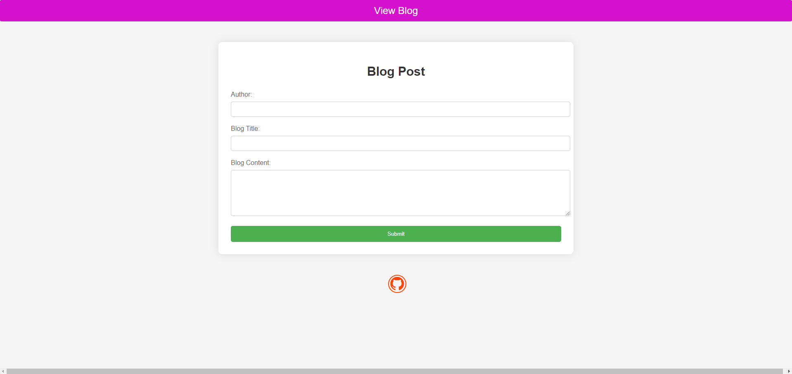
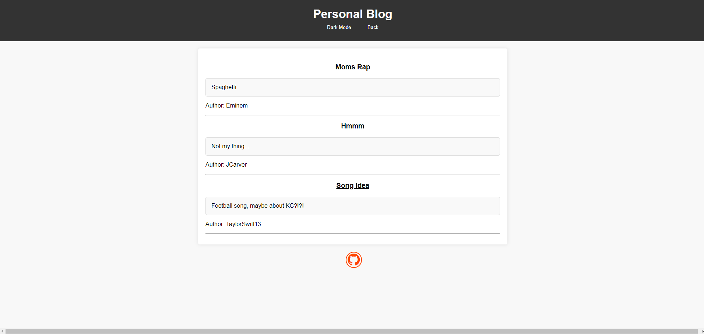

# Personal BLog

## Description

This is a simple little blog that users can post a title, blog, and sign off with their name. The idea of this was to create something simple to keep ideas and track them in local storage.

- I built this to create something simple that I can keep ideas or notes organized.
- This would be very helpful to keep chores on, grocery lists, bills, etc.
- This project mostly taught me about how to work with local storage on a basic level.
- I created a dark mode that changes the background for certain use cases.
- There is also an orange github symbol on the bottom of both pages that sends the user to my github page.

## Installation

I started off with the form page then once that was complete I made the basic blog post page. Made it very simple just to focus on the use of local storage.

## Usage

Here are a few screenshots of the two HTML pages.

 

## License

No license